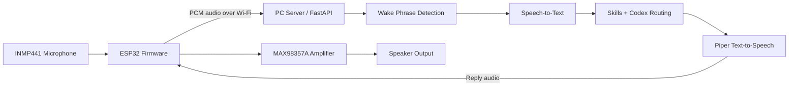
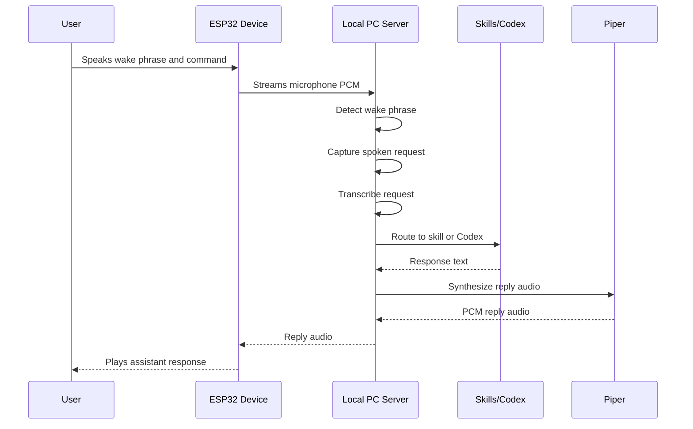

# ESP32 Live Voice Assistant

`ESP32 Live Voice Assistant` is a hardware-plus-software voice assistant system built around an ESP32 audio front end and a local PC server for wake detection, transcription, task execution, and spoken replies.

This is not just a chatbot connected to a microphone. It combines:

- embedded hardware wiring
- firmware development
- real-time audio capture and transport
- wake phrase detection
- speech-to-text
- local skill routing
- Codex task execution
- text-to-speech synthesis
- speaker playback back on the device

The result is a practical physical assistant workflow where an ESP32 with a microphone and speaker can stay always on, listen for a wake phrase, send the spoken request to a local server, and play the assistant response back through the connected amplifier and speaker.

## Quick Summary

- ESP32 audio endpoint with live microphone capture
- INMP441 microphone + MAX98357A amplifier + speaker wiring
- local server for wake detection, STT, skills, and Codex routing
- Piper voice synthesis for spoken replies
- response audio sent back to the ESP32 for playback

## Why This Project Is Interesting

This project crosses multiple layers that are usually separate:

- hardware integration
- firmware development
- local networking
- streaming audio handling
- speech processing
- tool orchestration
- local automation

It was built to move beyond "AI in a browser tab" into a real hardware-backed assistant workflow.

## What I Built

This system includes both the physical device layer and the software stack behind it.

### Hardware Side

I wired and configured:

- an `ESP32`
- an `INMP441` microphone
- a `MAX98357A` amplifier
- a speaker output chain

That hardware setup lets the ESP32 act as an always-on audio endpoint:

- microphone input for listening
- network transport to the server
- speaker playback for assistant replies

Shared-clock wiring used in this setup:

- `GPIO14` -> microphone `SCK` and amplifier `BCLK`
- `GPIO15` -> microphone `WS` and amplifier `LRC`
- `GPIO32` <- microphone `SD`
- `GPIO22` -> amplifier `DIN`

### Software Side

On the software side, I built a multi-stage voice pipeline that:

1. captures live PCM audio on the ESP32
2. streams audio from the ESP32 to a local PC server
3. listens for a wake phrase such as `hey dobby`
4. captures the spoken command after wake detection
5. routes the request to:
   - Codex for local actionable tasks, or
   - built-in utility skills such as time, weather, and lightweight research
6. generates spoken assistant output with Piper
7. sends reply audio back to the ESP32 for playback through the amp and speaker

## Core Capabilities

- always-on ESP32 audio front end
- live microphone PCM streaming to a local backend
- wake phrase detection
- speech-to-text with `faster-whisper`
- optional custom wakeword model support
- Codex-based task execution
- local skills engine
- text-to-speech reply generation with Piper
- speaker playback of assistant responses

## Architecture

This repo is split into two major parts:

- `firmware/assistant_client/`
  ESP32 firmware for microphone capture, transport, polling, and speaker playback
- `pc_server/`
  FastAPI backend for wake detection, STT, skills, Codex routing, and TTS

### System Diagram



### Runtime Pipeline



## Stack

- ESP32 firmware with I2S microphone and speaker output
- FastAPI backend
- `faster-whisper` for transcription
- optional `openWakeWord` / custom sklearn wakeword model support
- Groq API support for STT/chat fallback
- Piper for text-to-speech
- Codex CLI for local task execution

## Repo Layout

- `firmware/assistant_client/assistant_client.ino`
- `firmware/assistant_client/config.example.h`
- `pc_server/server.py`
- `pc_server/skills_engine.py`
- `pc_server/sklearn_wakeword.py`
- `pc_server/train_wakeword.py`
- `pc_server/requirements.txt`
- `pc_server/.env.example`
- `run_server.bat`

## Quick Start

### 1. Set up the PC server

```powershell
cd pc_server
python -m venv ..\.venv
..\.venv\Scripts\python.exe -m pip install -r requirements.txt
Copy-Item .env.example .env
```

Then edit `.env` and configure your local values for:

- `ASSISTANT_WORKSPACE`
- `CODEX_CMD`
- `PIPER_CMD`
- `PIPER_MODEL`
- `PIPER_CONFIG`
- optionally `GROQ_API_KEY`

Run the backend:

```powershell
cd pc_server
..\.venv\Scripts\python.exe -m uvicorn server:app --host 0.0.0.0 --port 8000
```

Or use:

```powershell
run_server.bat
```

### 2. Set up the ESP32 firmware

Copy:

- `firmware/assistant_client/config.example.h`

to:

- `firmware/assistant_client/config.h`

Then fill in:

- Wi-Fi name
- Wi-Fi password
- PC server URL

Open `firmware/assistant_client/assistant_client.ino` in Arduino IDE and upload it to the ESP32.

## Example Interaction

1. User says: `Hey Dobby`
2. Device streams live microphone audio to the server
3. Server detects the wake phrase and starts command capture
4. User says: `What is the weather in Richmond tomorrow?`
5. Server transcribes the request and routes it to the weather skill
6. Server generates a spoken answer
7. ESP32 plays the response through the amplifier and speaker

## Runtime Flow

1. ESP32 continuously captures mono `16 kHz` PCM
2. ESP32 streams audio frames to the local server
3. The server checks for the wake phrase
4. After wake detection, it captures the spoken request
5. The request is routed into skills, direct assistant behavior, or Codex task execution
6. The reply text is synthesized into audio
7. The ESP32 fetches and plays the reply through the amplifier and speaker

## Why The Design Matters

The project is intentionally split this way because the ESP32 is a good always-on audio endpoint, while the PC is better suited for:

- faster transcription
- wakeword experimentation
- task routing and tool use
- running Codex
- generating higher quality speech output

That separation lets the device stay lightweight while the heavier logic runs on the computer.

## Why It Is More Than A Simple Demo

This project required work across several layers at once:

- getting the ESP32 microphone and speaker chain working reliably
- wiring the mic, amp, and speaker correctly
- handling real PCM streaming instead of one-shot uploads
- coordinating embedded firmware with a Python backend
- training a custom wakeword model using more than 100 self-recorded positive and negative audio samples
- tuning wake and silence behavior
- integrating local automation through Codex
- managing reply synthesis and playback back on the device

That makes it a much more complete systems project than a typical single-layer AI demo.

## Privacy

- local config, secrets, trained wakeword artifacts, temp audio, voice models, and Piper binaries are intentionally excluded from the repo
- use `.env.example` and `config.example.h` as templates for local setup

## Current Status

This repo is best understood as a practical voice-assistant prototype focused on real hardware integration, local task execution, and voice-driven workflows rather than a generic chatbot demo.
